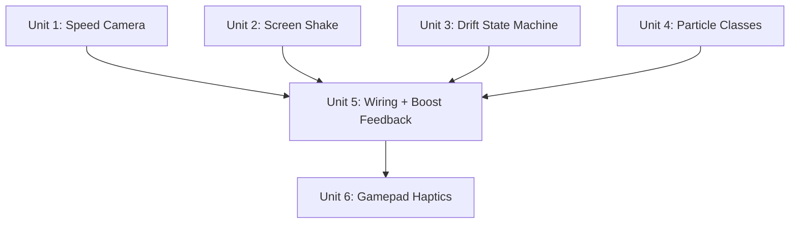

# feat: Gameplay juice pass — drift, shake, particles, haptics

## Overview

Add a coherent juice layer across 6 gameplay moments: speed-reactive camera, screen shake on wall impacts, drift state machine with spark particles and mini-boost reward, particle vocabulary (wall sparks, drift sparks, boost flame/burst), boost activation feedback (underglow, sound, particles), and gamepad haptic feedback.

The camera G-force system (cornering lean, FOV narrowing, boost FOV punch) was already implemented in `2026-03-31-001-feat-camera-g-force-plan.md`. This plan extends that system with speed-reactive FOV/distance, and adds the 5 remaining juice features.

## Problem Frame

The kart racer has functional mechanics but five sensory gaps: static camera at all speeds, silent/invisible boost activation (despite underglow light existing), no drift skill reward, single-type smoke particles for all events, and no gamepad haptics. (see origin: docs/brainstorms/2026-03-31-gameplay-juice-pass-requirements.md)

## Requirements Trace

- R1. Speed-reactive FOV widening (40→~52 at top speed)
- R2. Speed-reactive chase distance (6→~8 at top speed)
- R3. ~~Boost FOV punch~~ — **Already implemented** in camera G-force plan
- R4. Asymmetric easing (fast attack, slow release) — partially done for cornering, extend to speed
- R5. updateProjectionMatrix per frame — **Already implemented**
- R6-R9. Directional screen shake on wall impacts
- R10-R15. Drift state machine with stages, mini-boost, faster nitro fill, body lean scaling
- R16-R21. Particle vocabulary (wall sparks, drift sparks, boost flame, boost burst)
- R22-R25. Boost activation feedback (underglow, sound, particles, coordinated trigger)
- R26-R30. Gamepad haptic feedback

## Scope Boundaries

- **In scope:** Speed-reactive camera extension, screen shake, drift state machine, 4 particle types, boost visual/audio feedback, gamepad haptics
- **Out of scope:** Speed lines, tire marks, hit-stop, environment deformation, diegetic HUD, engine audio overhaul, multiplayer-specific effects
- **Not changing:** Existing SmokeTrails, existing engine audio pitch system, existing camera G-force lean/cornering FOV, physics constants
- **Already done (from camera G-force plan):** R3, R5, camera update signature, boost edge detection on Camera

## Context & Research

### Relevant Code and Patterns

- **Camera.js** — Already has G-force system with `vehicleState` param, `_prevBoostActive`, `_boostDelta`, `_currentFOV`, `baseFOV = 40`, asymmetric smoothing (`attackRate`, `releaseRate`). FOV formula: `targetFOV = baseFOV + boostDelta - corneringDelta`. Extend with `+ speedDelta`.
- **Vehicle.js** — `driftIntensity` computed at line 563: `|linearSpeed - acceleration| + |bodyNode.rotation.z| * 2`. Boost logic at lines 567-602. `debug.topSpeed = 250` base, `boostTopSpeed = 350`. Body lean at `updateBody()` lines 621-635.
- **Particles.js (SmokeTrails)** — Ring buffer pattern: pool of 64 sprites, `emitIndex` wraps, per-frame `update()` decays life/alpha/scale. Emit from wheel world positions. Material: `SpriteMaterial` with texture, transparent, depthWrite false.
- **Audio.js** — `playBeep()` at line 154 demonstrates Web Audio oscillator synthesis: `createOscillator()`, `createGain()`, frequency ramp, connect to `ctx.destination`. `playImpact()` at line 185 uses pool of 3 Audio objects.
- **Controls.js** — Gamepad read at line 117: `navigator.getGamepads()`, iterates, breaks on first. No reference retained.
- **main.js contactListener** — Lines 923-951. Has `manifold.worldSpaceNormal` (used to filter ground contacts), computes `speed` from `sphereVel` XZ magnitude, cooldown 0.3s, calls `audio.playImpact(speed)`.
- **PlayerManager.js** — SmokeTrails instantiated per player at lines 36, 47, 86. Updated per player at line 198. Map: `id → { vehicle, smokeTrails, spectating }`.

### Institutional Learnings

- Set topSpeed override once on activation, restore once on deactivation (not every frame) — from boost implementation
- Module integration: constructor injection, per-frame updates in animate loop, display state flow for HUD
- Boost physics: `driveForce = linearSpeed * topSpeed * dt`, so changing topSpeed auto-scales acceleration

## Key Technical Decisions

- **Effective top speed via max():** Instead of directly mutating `debug.topSpeed`, compute effective top speed each frame as `max(baseTopSpeed, nitroTopSpeed if active, miniBoostTopSpeed if active)`. Prevents one boost's expiry from clobbering another. New property `Vehicle.effectiveTopSpeed` used in the drive force calculation. (see origin: R13)
- **Speed FOV as additive delta:** Extend existing FOV formula: `targetFOV = baseFOV + speedDelta + boostDelta - corneringDelta`. Speed delta = `speedFOVMax * clamp(|linearSpeed|, 0, 1)` where `speedFOVMax = 12`. Composes naturally with existing cornering and boost offsets.
- **Drift threshold = 0.5:** Higher than smoke threshold (0.25) to avoid accidental triggering during gentle cornering. At full speed (linearSpeed ≈ 1) with moderate steering, `driftIntensity` ≈ 0.4-0.6, so Stage 1 requires deliberate cornering.
- **Wall spark position from vehicle + normal:** Use `vehicle.spherePos + offset * manifold.worldSpaceNormal` instead of extracting exact contact points via `getWorldSpaceContactPointOnA/B`. Simpler, avoids A/B body ordering, looks good enough for particle effects.
- **Boost activation detection centralized in game loop:** main.js tracks `wasBoostActive` and triggers underglow, particles, sound on the same frame. Camera's existing `_prevBoostActive` stays for FOV punch (already works). This avoids tightly coupling Camera to particle/audio systems.
- **Particle classes as standalone files:** Each in its own file following SmokeTrails pattern. Per-player instances managed in PlayerManager (drift sparks, boost flame) or main.js (wall sparks, boost burst — local player only).
- **Mini-boost values:** Stage 2: topSpeed 300, 1.5s. Stage 3: topSpeed 325, 2.0s. Intentionally weaker than nitro (350) to preserve nitro's role as the premium boost.

## Open Questions

### Resolved During Planning

- **Camera update signature:** Already accepts `vehicleState = {}` with `{ inputX, linearSpeed, boostActive, bodyLeanRoll }`. Just pass `driftStage` additionally for potential drift-reactive camera effects.
- **Drift threshold value:** 0.5 — higher than smoke (0.25), requires deliberate cornering at speed.
- **Wall spark texture:** Use existing `sprites/smoke.png` with orange color tint + additive blending. Zero asset cost; small bright additive sprites read as sparks in low-poly style.
- **Pool sizes:** Wall sparks: 12, drift sparks: 40, boost flame: 32, boost burst: 16. Total 100 new + 64 existing smoke = 164, well under 200 budget.
- **Boost sound:** Sawtooth oscillator, 200→600Hz sweep over 0.3s, gain attack 0.01s then exponential decay. Follows `playBeep` pattern.
- **Contact point for wall sparks:** Use vehicle sphere position + offset along contact normal. No need for `getWorldSpaceContactPointOnA/B`.

### Deferred to Implementation

- Exact drift stage timing thresholds (0.3s, 1.0s, 1.5s) — tune from playtesting
- Exact FOV and chase distance speed ranges — tune from feel
- Haptic intensity values — API behavior varies by browser/hardware, must tune empirically
- Remote player drift/boost visuals: derive synthetic `driftStage` from interpolated `driftIntensity` in `updateRemote()`, and add `boostActive` to network state (`getState()`/`setTargetState()`). See Unit 3 approach for details.

## High-Level Technical Design

> *This illustrates the intended approach and is directional guidance for review, not implementation specification. The implementing agent should treat it as context, not code to reproduce.*

```
Effective Top Speed Flow (per frame):
┌──────────────────────────────────────────────────┐
│ Vehicle.update()                                 │
│                                                  │
│ baseTopSpeed = 250                               │
│ nitroTopSpeed = boostActive ? 350 : 0            │
│ miniTopSpeed = miniBoostTimer > 0 ? miniVal : 0  │
│                                                  │
│ effectiveTopSpeed = max(base, nitro, mini)        │
│                                                  │
│ desiredSpeed = linearSpeed * effectiveTopSpeed    │
│                / speedScale                      │
└──────────────────────────────────────────────────┘

Drift State Machine:
┌────────────┐  0.3s above    ┌─────────┐  1.0s in    ┌─────────┐  1.5s in    ┌─────────┐
│  Stage 0   │───threshold───▶│ Stage 1 │──Stage 1──▶│ Stage 2 │──Stage 2──▶│ Stage 3 │
│  (no drift)│                │ (white) │            │(yellow) │            │(orange) │
└─────▲──────┘                └────┬────┘            └────┬────┘            └────┬────┘
      │        drops below         │     drops below      │    drops below      │
      │◀───────threshold───────────┘◀─────threshold───────┘◀────threshold───────┘
      │                            │                      │                     │
      │    (no reward)             │   (no reward)        │  mini-boost 300     │ mini-boost 325
      └────────────────────────────┘──────────────────────┘─────────────────────┘

Camera FOV Composition:
  targetFOV = baseFOV(40) + speedDelta(0..12) + boostDelta(8..0 decay) - corneringDelta(0..8)
  Range: ~32 (tight corner) to ~60 (boost at speed)
```

## Implementation Units



- [ ] **Unit 1: Speed-reactive camera FOV and chase distance**

  **Goal:** Extend the existing camera G-force system with speed-based FOV widening and chase distance pull-back.

  **Requirements:** R1, R2, R4

  **Dependencies:** None (extends existing Camera G-force system)

  **Files:**
  - Modify: `js/Camera.js`

  **Approach:**
  - Add new properties: `speedFOVMax = 12`, `speedDistMax = 2`, `baseChaseDistance = 6`.
  - In the G-force block, compute `speedDelta = speedFOVMax * clamp(abs(vehicleState.linearSpeed), 0, 1)`. Add to FOV formula: `targetFOV = baseFOV + speedDelta + boostDelta - corneringDelta`.
  - Compute dynamic chase distance: `this.chaseDistance = baseChaseDistance + speedDistMax * clamp(abs(linearSpeed), 0, 1)`. Use asymmetric smoothing (existing `attackRate`/`releaseRate`) for the distance too.
  - For R4 (asymmetric snap-back): the existing asymmetric smoothing pattern already handles this — `attackRate` when target > current, `releaseRate` when target < current. Apply to speed-based values the same way.

  **Patterns to follow:**
  - Existing G-force FOV computation in Camera.js lines 154-177
  - Existing `1 - Math.exp(-rate * dt)` smoothing pattern

  **Test scenarios:**
  - Happy path: Accelerating from idle to top speed → FOV visibly widens from 40 toward ~52, chase distance increases
  - Happy path: Braking from top speed → FOV and distance snap back faster than they ramped up
  - Happy path: Boost at top speed → FOV peaks at ~60 (speed 12 + boost 8), then boost decays leaving speed-based FOV
  - Edge case: Cornering at top speed → speed FOV (+12) partially offset by cornering FOV (-8), net FOV ~44
  - Edge case: Idle with no input → FOV stays at 40, chase distance at 6

  **Verification:**
  - Visual: driving fast feels perceptibly different from idle through the camera lens
  - Visual: boost at speed produces the most dramatic FOV, which smoothly settles as boost decays

- [ ] **Unit 2: Screen shake on wall impacts**

  **Goal:** Add directional camera shake triggered by wall collisions.

  **Requirements:** R6, R7, R8, R9

  **Dependencies:** None

  **Files:**
  - Modify: `js/Camera.js`
  - Modify: `js/main.js` (contactListener)

  **Approach:**
  - Add shake state to Camera: `_shakeOffset = new THREE.Vector3()`, `_shakeDecay = 0`, `MAX_SHAKE = 0.3`.
  - Add method `applyShake(normalX, normalZ, magnitude)`: sets `_shakeOffset` to direction scaled by clamped magnitude, sets `_shakeDecay = 1`.
  - In `update()`, apply shake: add `_shakeOffset * _shakeDecay` to `this.chaseSmooth` after the lerp (line 126) but before copying to `camera.position` (line 127). This way `lookAt()` naturally adjusts to the shaken position, producing directional feel. Decay `_shakeDecay` exponentially each frame (`_shakeDecay *= Math.exp(-15 * dt)` — fast decay, ~150ms to near-zero). Reset when below epsilon.
  - In main.js `contactListener.onContactAdded`, inside the existing cooldown check (same block as `audio.playImpact(speed)`): call `cam.applyShake(n[0], n[2], speed)` where `n = manifold.worldSpaceNormal`. The `wallSparks.emit()` call (added in Unit 5) also goes inside this same cooldown check. **Note:** `worldSpaceNormal` points from body A to body B. Check `bodyA === vehicle.rigidBody` — if true, negate the normal so sparks always scatter away from the vehicle.

  **Patterns to follow:**
  - Existing `manifold.worldSpaceNormal` usage in contactListener (line 930-935)
  - Exponential decay pattern from Camera.js

  **Test scenarios:**
  - Happy path: Head-on wall hit at high speed → camera jolts visibly in the collision direction, decays to still within ~200ms
  - Happy path: Glancing wall scrape → subtle shake, proportional to impact speed
  - Edge case: Multiple rapid wall hits (within cooldown) → only first triggers shake (existing 0.3s cooldown)
  - Edge case: Ground contacts (normal mostly vertical) → no shake (existing filter: `|n[1]| > 0.5`)
  - Edge case: Impact speed below 1.5 → no shake (existing threshold)

  **Verification:**
  - Visual: wall impacts feel consequential — screen jolts in the direction you hit
  - Visual: shake never exceeds ~0.3 units even at maximum impact speed

- [ ] **Unit 3: Drift state machine and effective top speed**

  **Goal:** Add drift stage progression, mini-boost reward, faster nitro fill, body lean scaling, and effective top speed management.

  **Requirements:** R10, R11, R12, R13, R14, R15

  **Dependencies:** None

  **Files:**
  - Modify: `js/Vehicle.js`

  **Approach:**
  - Add new state properties: `driftStage = 0`, `driftStageTimer = 0`, `miniBoostTimer = 0`, `miniBoostTopSpeed = 0`, `effectiveTopSpeed = 250`. Add constants to `debug`: `driftStageThreshold = 0.5`, `stage0Duration = 0.3` (time in Stage 0 above threshold to reach Stage 1), `stage1Duration = 1.0` (time in Stage 1 to reach Stage 2), `stage2Duration = 1.5` (time in Stage 2 to reach Stage 3), `miniBoostStage2Speed = 300`, `miniBoostStage3Speed = 325`, `miniBoostStage2Duration = 1.5`, `miniBoostStage3Duration = 2.0`.
  - **Execution order within `update()` must be restructured.** Currently: drive force (line 500) → boost logic (lines 567-602) → driftIntensity (line 563). The refactored order must be:
    1. Compute `driftIntensity` (move up, before drive force)
    2. Update drift state machine (stage transitions, mini-boost grant on release)
    3. Decrement `miniBoostTimer`
    4. Run nitro boost logic (fill rate with drift stage multiplier, activation/deactivation)
    5. Compute `effectiveTopSpeed = max(debug.topSpeed, boostActive ? debug.boostTopSpeed : 0, miniBoostTimer > 0 ? miniBoostTopSpeed : 0)`
    6. Drive force calculation using `effectiveTopSpeed`
  - **Drift stage progression:**
    - If `driftIntensity >= threshold` and currently in stage: increment `driftStageTimer += dt`. If timer exceeds current stage's duration, advance to next stage (cap at 3). Reset timer on stage advance.
    - If `driftIntensity < threshold` and `driftStage > 0`: this is a drift release. If `driftStage >= 2`, set `miniBoostTimer` and `miniBoostTopSpeed` based on stage. Then reset `driftStage = 0`, `driftStageTimer = 0`.
  - **Effective top speed** (replaces direct `debug.topSpeed` mutation):
    - On nitro boost activation: no longer set `debug.topSpeed = boostTopSpeed`. On expiry: no longer reset `debug.topSpeed = 250`. Both are handled by the `effectiveTopSpeed` max() calculation.
  - **Faster nitro fill during drift** (R14): In the boost fill section, multiply `fillRate` by `stageFillMultiplier[driftStage]` where the array is indexed by stage: `[1.0, 1.0, 1.5, 2.0]` (stages 0-3 respectively).
  - **Body lean scaling** (R15): In `updateBody()`, scale the roll divisor: use `debug.bodyLeanRoll / (1 + driftStage * 0.3)` so higher stages produce more aggressive lean.
  - **Remote player support:** In `updateRemote()`, after interpolating `driftIntensity`, derive a synthetic `driftStage` from `driftIntensity` value (e.g., 0 if below threshold, 1 if above threshold, 2 if above 1.5, 3 if above 2.5). This is an approximation but gives remote players visible drift sparks. Also add `boostActive` to `getState()` and `setTargetState()` so remote BoostFlame emits correctly.

  **Patterns to follow:**
  - Existing boost timer pattern (lines 567-602)
  - Existing `driftIntensity` computation (line 563)
  - `updateBody()` lean formula (lines 621-635)

  **Test scenarios:**
  - Happy path: Sustained cornering at speed for 0.3s → `driftStage` transitions from 0 to 1
  - Happy path: Holding drift for 1.0s in Stage 1 → transitions to Stage 2
  - Happy path: Releasing drift at Stage 2 → `miniBoostTimer` set, effective top speed increases to 300 for 1.5s
  - Happy path: During Stage 2 drift, nitro meter fills 1.5x faster than normal drift
  - Happy path: Body lean visibly increases at higher drift stages
  - Edge case: Momentary dip below threshold during Stage 1 → resets to Stage 0, no mini-boost
  - Edge case: Mini-boost active when nitro activates → effective top speed = max(300, 350) = 350 (nitro wins)
  - Edge case: Nitro expires while mini-boost still active → effective top speed drops to mini-boost value (300), not base (250)
  - Edge case: Both boosts expire → effective top speed returns to base (250)
  - Integration: Drift at Stage 3 → release → mini-boost at 325 for 2s → nitro already partially filled from drift → activate nitro → effective top speed 350

  **Verification:**
  - `driftStage` visible in debug or console; progresses 0→1→2→3 during sustained drift
  - Mini-boost grants a perceptible speed increase after drift release at Stage 2+
  - Nitro and mini-boost coexist without overwriting each other

- [ ] **Unit 4: Particle emitter classes**

  **Goal:** Create 4 standalone particle emitter classes following the SmokeTrails pattern.

  **Requirements:** R16, R17, R18, R19, R20, R21

  **Dependencies:** None

  **Files:**
  - Create: `js/WallSparks.js`
  - Create: `js/DriftSparks.js`
  - Create: `js/BoostFlame.js`
  - Create: `js/BoostBurst.js`

  **Approach:**
  - Each class follows the SmokeTrails pattern: constructor takes `scene`, creates a flat array of sprites with `SpriteMaterial` clones, ring-buffer `emitIndex`, per-frame `update(dt)` that decays and recycles. Each particle has a fixed `lifetime` constant (not a range); variation comes from velocity scatter, not time. Color is set per-emit (new particles reflect current stage color; existing particles keep their original color until recycled).
  - Each class must include a `dispose()` method that removes all sprites from the scene and disposes materials. This prevents sprite leaks when remote players disconnect. Wire `dispose()` into `PlayerManager.removeRemotePlayer()`.
  - **WallSparks (pool 12):** `emit(worldPos, normalX, normalZ, magnitude)` — burst of 6-8 sprites at position, velocity scattered outward from normal, gravity = -5 y/s, lifetime ~0.2s. Material: `sprites/smoke.png`, color orange `0xff8800`, additive blending.
  - **DriftSparks (pool 40):** `update(dt, vehicle)` — if `vehicle.driftStage > 0`, emit from rear wheel world positions. Color based on `driftStage`: 1=`0xaaddff` (white-blue), 2=`0xffdd44` (yellow), 3=`0xff6622` (orange). Small scale (0.1-0.15), lifetime ~0.15s, slight outward scatter, no gravity. Material: additive blending.
  - **BoostFlame (pool 32):** `update(dt, vehicle)` — if `vehicle.boostActive || vehicle.miniBoostTimer > 0`, emit from rear wheel positions. Color `0xff4400` (hot orange-red), additive blending, lifetime ~0.3s, velocity biased backward (opposite vehicle forward), slight upward drift.
  - **BoostBurst (pool 16):** `emit(worldPos, forwardX, forwardZ)` — one-shot radial burst behind vehicle. 12-16 sprites, velocity scattered in a cone behind the vehicle, color `0xffaa00`, additive, lifetime ~0.3s, slight gravity.
  - All use `sprites/smoke.png` with color tint (zero new assets).

  **Patterns to follow:**
  - `js/Particles.js` SmokeTrails class — full pattern reference (ring buffer, emit, update, sprite lifecycle)

  **Test scenarios:**
  - Happy path: WallSparks.emit() creates visible orange burst at the specified position
  - Happy path: DriftSparks emits continuously during drift, color matches stage
  - Happy path: BoostFlame emits during boost, trail visible behind vehicle
  - Happy path: BoostBurst creates a radial explosion on boost activation
  - Edge case: Rapid wall hits within cooldown → WallSparks pool recycles cleanly, no visual glitch
  - Edge case: All pools simultaneously active (drift + boost + wall hit) → total sprites under 200

  **Verification:**
  - Each particle type visually distinct from smoke by color and behavior
  - No dropped frames when multiple emitters active simultaneously

- [ ] **Unit 5: Boost activation feedback and particle wiring**

  **Goal:** Wire all particle emitters, add boost underglow toggle, add boost sound, centralize boost activation detection.

  **Requirements:** R22, R23, R24, R25 (plus wiring for R16-R19)

  **Dependencies:** Unit 2 (screen shake on Camera), Unit 3 (drift state machine on Vehicle), Unit 4 (particle classes)

  **Files:**
  - Modify: `js/Audio.js` (add `playBoostWhoosh`)
  - Modify: `js/main.js` (boost transition detection, wall spark wiring, boost burst wiring)
  - Modify: `js/PlayerManager.js` (drift sparks, boost flame per player)

  **Approach:**
  - **Audio.js — add `playBoostWhoosh()`:** Same pattern as `playBeep`. Create sawtooth oscillator, frequency ramp 200→600Hz over 0.3s, gain attack 0.01s then exponential decay to 0.001. Connect to `ctx.destination`.
  - **PlayerManager.js — add per-player particle emitters:** In the player map entry, add `driftSparks: new DriftSparks(scene)` and `boostFlame: new BoostFlame(scene)`. In `update()`, call `entry.driftSparks.update(dt, entry.vehicle)` and `entry.boostFlame.update(dt, entry.vehicle)` alongside existing `smokeTrails.update()`. Import the classes.
  - **main.js — boost activation detection:** Before the camera update in the animate loop, check `vehicle.boostActive && !wasBoostActive`. On activation: (1) set `vehicle.underglowLight.visible = true`, change color to `0xff8800`; (2) call `audio.playBoostWhoosh()`; (3) call `boostBurst.emit(vehicle.spherePos, forwardX, forwardZ)` using vehicle's forward vector. On deactivation (`!vehicle.boostActive && wasBoostActive`): set `vehicle.underglowLight.visible = false`, restore color to `0x00ffff`. Track `wasBoostActive` as a closure variable.
  - **main.js — wall spark wiring:** In `contactListener.onContactAdded`, after the existing `audio.playImpact(speed)` and new `cam.applyShake(n[0], n[2], speed)`, call `wallSparks.emit(vehicle.spherePos, n[0], n[2], speed)` where `n = manifold.worldSpaceNormal`. Offset position slightly in the normal direction.
  - **main.js — instantiate local-only emitters:** Create `wallSparks = new WallSparks(scene)` and `boostBurst = new BoostBurst(scene)` during init. Call their `update(dt)` in the animate loop for particle lifecycle.

  **Patterns to follow:**
  - `playBeep` in Audio.js (oscillator synthesis pattern)
  - PlayerManager SmokeTrails instantiation and per-player update
  - contactListener existing wiring for audio

  **Test scenarios:**
  - Happy path: Boost activation → underglow turns orange, whoosh sound plays, radial burst particles appear behind vehicle, all on same frame
  - Happy path: Boost expires → underglow turns off, flame trail stops, color resets to cyan
  - Happy path: Wall hit → sparks emit at impact point in collision direction, simultaneous with shake and impact sound
  - Happy path: Drift sparks appear during drift with correct stage color, visible on both local and remote players
  - Happy path: Boost flame trail visible during nitro and mini-boost
  - Edge case: Boost activates while drifting → drift sparks + boost flame + boost burst all visible simultaneously
  - Edge case: Wall hit during boost → wall sparks + boost flame both rendering
  - Integration: Full sequence — drift to Stage 3, release (mini-boost + drift sparks stop + flame starts), activate nitro (underglow + whoosh + burst), hit wall (shake + wall sparks) — all effects compose cleanly

  **Verification:**
  - Boost activation is unmistakable — coordinated visual, audio, and lighting response
  - All particle types render distinctly alongside existing smoke trails
  - No audio errors or visual glitches during rapid state transitions

- [ ] **Unit 6: Gamepad haptic feedback**

  **Goal:** Add haptic feedback for speed, impacts, boost, and drift stage transitions.

  **Requirements:** R26, R27, R28, R29, R30

  **Dependencies:** Unit 5 (events are wired, states are trackable)

  **Files:**
  - Create: `js/Haptics.js`
  - Modify: `js/main.js` (instantiate and wire)

  **Approach:**
  - **Haptics.js:** Small module that manages gamepad vibration.
    - `update(dt)`: poll `navigator.getGamepads()`, store reference to first gamepad with `vibrationActuator`. Track a `_rumbleTimer` for throttled continuous rumble (~100ms intervals).
    - `setRumble(intensity)`: if `_rumbleTimer` expired, call `gamepad.vibrationActuator.playEffect('dual-rumble', { duration: 150, strongMagnitude: intensity * 0.3, weakMagnitude: intensity * 0.5 })`. Reset timer. Intensity 0-1 mapped from vehicle speed.
    - `impulse(intensity)`: one-shot strong vibration for impacts. `playEffect('dual-rumble', { duration: 100, strongMagnitude: clamp(intensity * 0.15, 0, 1) })`.
    - `pulse()`: short weak pulse for drift stage transitions. `playEffect('dual-rumble', { duration: 80, weakMagnitude: 0.3 })`.
    - All methods wrapped in try-catch with graceful no-op on failure. Feature detection: check `gamepad?.vibrationActuator?.playEffect` before calling.
  - **main.js wiring:** Instantiate `haptics = new Haptics()`. In animate loop: `haptics.update(dt)`, `haptics.setRumble(Math.abs(vehicle.linearSpeed))`. In contactListener: `haptics.impulse(speed / 10)`. On boost activation: `haptics.setRumble(0.8)`. On drift stage change (compare `prevDriftStage` each frame): `haptics.pulse()`.

  **Patterns to follow:**
  - Controls.js gamepad polling pattern (line 117)

  **Test scenarios:**
  - Happy path: Driving with gamepad at increasing speed → rumble intensifies
  - Happy path: Wall hit with gamepad → sharp vibration spike
  - Happy path: Boost activation → sustained medium rumble
  - Happy path: Drift stage transition → brief pulse
  - Edge case: No gamepad connected → all haptic calls silently no-op
  - Edge case: Gamepad without vibrationActuator → graceful degradation, no errors
  - Edge case: Gamepad disconnected mid-session → next poll finds no gamepad, stops haptics

  **Verification:**
  - With a gamepad: distinct haptic patterns for speed, impact, boost, and drift
  - Without a gamepad: zero console errors, no performance impact

## System-Wide Impact

- **Interaction graph:** Camera reads vehicle state (existing pattern, extended). ContactListener triggers Camera.applyShake + WallSparks.emit + Haptics.impulse. PlayerManager manages DriftSparks and BoostFlame per player. Main.js animate loop detects boost transitions for underglow + audio + BoostBurst + haptics.
- **Error propagation:** All new systems degrade gracefully — missing vehicle state defaults to zero, missing gamepad API no-ops, particle pools recycle without error.
- **State lifecycle risks:** The effective top speed refactor (R13) is the highest-risk change — if `effectiveTopSpeed` isn't computed before the drive force line, the vehicle won't move correctly. The old `debug.topSpeed` mutation in the nitro logic must be fully replaced.
- **API surface parity:** Remote players get drift sparks and boost flame via PlayerManager (same as smoke trails). Screen shake, wall sparks, boost burst, haptics are local-player-only — correct behavior.
- **Network state change:** `getState()` adds `boostActive` to the sync payload. `driftStage` is derived locally from interpolated `driftIntensity` on remote vehicles (no network field needed). This is a minor protocol addition.
- **Unchanged invariants:** Existing SmokeTrails, existing engine audio, physics constants. Note: gamepad boost button is not currently mapped (Controls.js only maps keyboard Shift) — this is a pre-existing gap, not introduced by this plan.

## Risks & Dependencies

| Risk | Mitigation |
|------|------------|
| Effective top speed refactor breaks drive force calculation | Unit 3 is self-contained in Vehicle.js. Test that base driving feels identical before and after the refactor. |
| 200 sprite budget exceeded during intense gameplay | Pool sizes total 164 including smoke. Monitor with a simple `activeCount` log during testing. |
| Drift threshold too high/low for fun | Exposed as `debug.driftStageThreshold` for real-time tuning. |
| Gamepad vibration API varies across browsers | All haptic calls wrapped in try-catch with feature detection. |
| Multiple particle emitters cause dropped frames on mobile | Budget cap of 200 sprites. Each emitter has small pool. Test on low-end device. |
| Mini-boost + nitro interaction feels confusing to players | Mini-boost is intentionally weaker (300/325 vs 350). Speed difference is subtle — the visual feedback (flame trail persisting) is the primary signal. |

## Sources & References

- **Origin document:** [docs/brainstorms/2026-03-31-gameplay-juice-pass-requirements.md](docs/brainstorms/2026-03-31-gameplay-juice-pass-requirements.md)
- **Prior plan:** [docs/plans/2026-03-31-001-feat-camera-g-force-plan.md](docs/plans/2026-03-31-001-feat-camera-g-force-plan.md) — camera G-force already implemented
- Related code: `js/Camera.js`, `js/Vehicle.js`, `js/Particles.js`, `js/Audio.js`, `js/Controls.js`, `js/main.js`, `js/PlayerManager.js`
