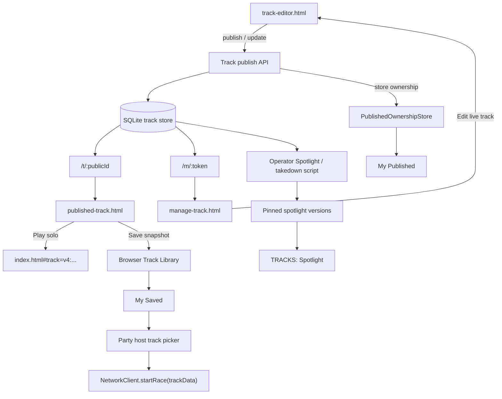

# feat: Track publishing and spotlight MVP

## Overview

Add backend-backed track publishing to support the MVP loop defined in the origin requirements: create a track, publish it, share one permanent public link, let anyone with that link play it, let visitors save frozen copies into their own library, and let staff curate a separate in-game Spotlight shelf. Keep the in-game TRACKS page curated and personal rather than turning it into an open public catalog.

## Problem Frame

Kart Kids already has the ingredients for local creation and ad hoc sharing, but they are split across disconnected systems. `server.js` only serves static files and room WebSockets, `js/GameEngine.js` can load `#track=v4:` payloads but has no stable public track identity, `js/TrackSaves.js` and `js/track-editor/services/ProjectStorageService.js` persist different local shapes, and `js/TrackRegistry.js` currently ships only one official track. That leaves the project without a real shared track platform, without a way to curate public highlights, and without a clean bridge from “someone shared a link with me” to “I can use this in my own party flow.”

This plan turns the origin requirements into a friend-share-first platform: published tracks become stable server records with permanent public URLs and separate manage links; Spotlight becomes a frozen editorial snapshot surface; `My Saved` becomes the playable personal snapshot library; and `My Published` becomes a local/manage surface backed by secret ownership credentials rather than public catalog browsing. (see origin: `docs/brainstorms/2026-04-13-track-publishing-spotlight-mvp-requirements.md`)

## Requirements Trace

- R1. Support backend-backed published tracks with stable public URLs
- R2. Publish with track title plus existing profile display name as creator name
- R3. Publish immediately after publish validation passes
- R4. Use a dedicated publish-validation ruleset with a playable + 2-racer-ready minimum bar
- R5. Require no accounts and issue a secret manage link for update/unpublish
- R6. Open public links on a landing page with title, creator, solo play, and save actions
- R7. Keep the public URL pointed at the latest live version
- R8. Update live published tracks in place without changing the public URL
- R9. Stop future public access on unpublish/takedown while preserving previously saved snapshots
- R10. Restructure TRACKS into `Official`, `Spotlight`, `My Published`, and `My Saved`
- R11. Launch MVP with 2 official tracks
- R12. Keep Spotlight as a staff-curated shelf, not an open community catalog
- R13. Make `My Published` a manage-oriented surface rather than the primary playable library
- R14. Make `My Saved` the playable personal snapshot library
- R15. Allow visitors to save public tracks into `My Saved`
- R16. Keep saved public-track copies frozen after save
- R17. Auto-create or refresh the creator's own playable snapshot after publish/update
- R18. Allow solo play directly from the public track page
- R19. Route multiplayer usage through the normal party host flow after saving the track
- R20. Do not require direct party creation from the public track page
- R21. Let staff spotlight any published track without a creator submission workflow
- R22. Freeze Spotlight on an approved version even when the creator updates live later
- R23. Let staff take down public tracks without invalidating already-saved snapshots

## Scope Boundaries

- No open in-game browse surface for all published community tracks
- No account system, sign-in flow, or creator profile management
- No browser-based staff admin console in MVP
- No ratings, comments, reports, or creator-to-creator social features
- No auto-update prompts for already-saved snapshots in `My Saved`
- No direct “start party from public page” flow
- No recovery flow if a creator loses both the manage link and their local browser ownership record

### Deferred to Separate Tasks

- Open community browsing beyond the curated Spotlight shelf
- Account-based creator ownership recovery and cross-device sync
- Rich social previews or richer landing-page media beyond the MVP minimap/metadata treatment

## Context & Research

### Relevant Code and Patterns

- `server.js` is currently a small monolithic HTTP + WebSocket server. It has no persistence layer, but it already carries `trackData` during private-lobby race start and therefore does not need a new multiplayer transport contract for shared tracks.
- `js/GameEngine.js` already boots races from either `config.trackData` or `#track=v4:` payloads, which makes v4 JSON the natural canonical track payload for publish, public play, save-to-library, and party re-use.
- `js/ui/core/RouterService.js` is intentionally hash-based so the main shell never needs server rewrites. That makes public share pages a better fit as standalone server-routed pages rather than more AppShell routes.
- `js/ui/overlays/LobbyOverlay.js` and `js/Network.js` already support host-selected raw `trackData` in private rooms, so the MVP only needs public tracks to become local saved snapshots before party hosting.
- `js/TrackSaves.js`, `js/track-editor/services/ProjectStorageService.js`, and `js/ui/components/TrackBrowser.js` reveal the current track-library fragmentation: different local keys, different record shapes, and selection keyed partly by names instead of stable ids.
- `js/track-editor/services/ValidationService.js` already has the issue taxonomy needed to build a dedicated publish-readiness layer without forking the whole validator.
- `tests/unit/server-rooms.spec.js` and `tests/e2e/play-modes.spec.js` show the current testing posture: `node:test` for backend behavior and Playwright for menu/play flow verification.

### Institutional Learnings

- No `docs/solutions/` entries exist for published-track persistence, public share pages, or Spotlight curation yet.

### External References

- The current local runtime is Node `v20.19.4`, while the official `node:sqlite` module was added in Node `v22.5.0`; implementation therefore needs a Node 20-compatible SQLite driver or a runtime upgrade before it can use the built-in module.
- SQLite's WAL mode is designed for single-host deployments and allows concurrent readers while a single writer appends changes, which matches this MVP's small self-hosted/public-link workload.
- Node's `crypto.randomUUID()` uses a cryptographically secure random source, which is suitable for opaque public ids or manage-link secrets; bearer-style manage links should still be stored server-side as hashes rather than raw secrets.

## Key Technical Decisions

- **Use server-side persistence from day one:** The storage model should be SQLite-backed rather than a monolithic JSON file because the MVP needs durable public ids, live-vs-frozen version semantics, takedown state, and Spotlight references. Implementation can choose the exact Node 20-compatible SQLite driver during execution, but the persistence model itself should not be revisited unless install constraints force a re-plan.
- **Serve public and manage flows as standalone HTTP pages:** Public share URLs and secret manage URLs should resolve outside the hash-routed AppShell, using dedicated server routes such as `/t/:publicId` and `/m/:token` so links work cleanly when posted publicly and do not depend on in-shell navigation state.
- **Keep public ids opaque:** Use random public ids rather than title slugs. Public tracks are intentionally playable by link, but they should not become trivially enumerable just because MVP does not ship an open catalog.
- **Model live tracks and version snapshots separately:** Each published track should keep a stable public record plus immutable version snapshots. Live public pages resolve to the latest version pointer, while Spotlight pins a specific reviewed version.
- **Treat manage links as bearer credentials:** Generate manage tokens with `node:crypto`, store only token hashes server-side, and never expose the manage token on public pages, Spotlight payloads, or normal `My Saved` records.
- **Introduce a real browser-side track library abstraction:** Use stable typed ids such as `official:starter-circuit`, `spotlight:<entryId>`, `saved:<recordId>`, and `published:<publicId>` instead of extending the current name-based `user:` scheme. This lets the project distinguish live published records, frozen saved snapshots, and curated spotlight entries without collisions.
- **Keep `My Published` and `My Saved` separate by contract:** `My Published` is a manage surface hydrated from locally stored ownership credentials plus server data. `My Saved` is a frozen local snapshot library used for play and party hosting. Publishing or updating a live track should auto-refresh the creator's own `My Saved` snapshot so their playable copy stays in sync with their live public work.
- **Use operator tooling instead of admin auth in MVP:** Staff Spotlight and takedown actions should run through a small operator-only CLI or local admin script backed by the same store, avoiding a separate admin authentication surface in this MVP.
- **Reuse v4 JSON everywhere:** The publish API, public pages, `My Saved` snapshots, editor deep links, and runtime loading should all treat v4 JSON as the canonical payload so the project does not invent a second track format.

## Alternative Approaches Considered

- **Single JSON file store:** Rejected because the MVP needs version pinning, public/manage lookup surfaces, takedown state, and incremental editorial operations. A JSON file could work for a throwaway demo, but it would become the next bottleneck as soon as public sharing and Spotlight start interacting.
- **Hash-routed public page inside `index.html`:** Rejected because AppShell routing is intentionally hash-based for menu navigation and assumes the game shell is present. Public share URLs need cleaner standalone entrypoints and should not depend on shell boot logic just to show a landing page.
- **Accounts and web admin from day one:** Rejected because the product promise is friend-share-first, not creator-platform-first. Secret manage links plus operator scripts cover the MVP with much lower scope and auth risk.

## Open Questions

### Resolved During Planning

- **What blocks publish versus what stays a warning?** Publish readiness should be a separate layer over `ValidationService`: block on existing structural/connectivity errors, on fewer than 2 spawn points, on missing required metadata such as title, and on malformed/unpersistable v4 payloads. Softer issues such as no powerups or a short track remain visible warnings but do not block shareability.
- **How should manage links behave in MVP?** Each published track gets one active secret manage token with no expiry or rotation in MVP. The token is hashed at rest. The browser-local `My Published` entry is a convenience cache, not the source of truth; the secret manage link is the portable authority.
- **How should the public landing page be implemented?** As standalone server-routed pages plus JSON APIs, not as AppShell routes.
- **What format should `My Saved` use for imported public tracks?** Save a frozen local v4 snapshot plus metadata such as `publicId`, `versionId`, title, creator name, and saved timestamp. Race and party flows should load the local snapshot directly rather than resolving the live public record at play time.
- **What minimal staff tooling is needed?** Operator-only scripts or CLI commands to list published tracks, pin/remove Spotlight versions, and take down/restore public availability. No player-facing admin UI is needed for MVP.
- **How should takedown behave?** Public track routes should become unavailable for new visitors after takedown, Spotlight entries should disappear, but the creator's manage route should still show taken-down status and previously saved local snapshots should continue to work.
- **How does `My Published` work without accounts?** Publishing stores the `publicId` and secret manage credential metadata locally. Opening a manage link on another browser should offer a way to import that ownership into the local `My Published` list on that device.

### Deferred to Implementation

- **Which exact SQLite driver should be used on Node 20?** The storage model is fixed to SQLite, but the exact package choice can be finalized during implementation once install/build ergonomics are confirmed in the repo.
- **What exact API path names and response envelopes should the server expose?** The plan fixes the route categories and data ownership, but exact endpoint names can stay implementation-local as long as public ids, manage tokens, live versions, and Spotlight snapshots map cleanly.
- **How much public-page polish belongs in MVP beyond the core actions?** The landing page must support preview, solo play, and save-to-library, but exact motion, copy, and secondary affordances can be tuned during implementation.

## Output Structure

```text
data/
  tracks.sqlite                 # runtime artifact, not committed
server/
  tracks/
    TrackDatabase.js
    PublishedTrackRepository.js
    SpotlightRepository.js
    ManageTokenService.js
    TrackRoutes.js
    TrackAdmin.js
js/
  track-library/
    TrackLibraryStore.js
    PublishedOwnershipStore.js
    PublishedTrackApi.js
    TrackRecordMappers.js
  ui/public-track/
    PublishedTrackPage.js
    ManagePublishedTrackPage.js
published-track.html
manage-track.html
tests/
  unit/
    server-published-tracks.spec.js
    server-track-routes.spec.js
    publish-readiness.spec.js
    track-library-store.spec.js
  e2e/
    track-publishing.spec.js
docs/
  track-publishing-ops.md
```

## High-Level Technical Design

> *This illustrates the intended approach and is directional guidance for review, not implementation specification. The implementing agent should treat it as context, not code to reproduce.*



## Implementation Units

- [ ] **Unit 1: Server persistence and published-track domain**

**Goal:** Add the durable server-side store for published tracks, immutable version snapshots, secret manage credentials, and Spotlight references.

**Requirements:** R1, R5, R7, R8, R9, R21, R22, R23

**Dependencies:** None

**Files:**
- Modify: `package.json`
- Modify: `server.js`
- Create: `server/tracks/TrackDatabase.js`
- Create: `server/tracks/PublishedTrackRepository.js`
- Create: `server/tracks/SpotlightRepository.js`
- Create: `server/tracks/ManageTokenService.js`
- Test: `tests/unit/server-published-tracks.spec.js`

**Approach:**
- Introduce a small track-publishing data layer bootstrapped from `server.js` and backed by a SQLite database file stored under `data/`.
- Model a stable `published_tracks` record separate from `published_track_versions` so the server can keep one permanent public id while preserving immutable snapshots for Spotlight and auditability.
- Store public ids, title, creator name, status, timestamps, and the current live version pointer in the public-track record.
- Store secret manage tokens only as hashes, with comparison handled through a dedicated token service. Keep public ids and manage secrets distinct.
- Represent takedown and unpublish as explicit status transitions rather than hard deletion so public availability, creator manage state, and historical snapshots can diverge safely.
- Keep the store scoped to a single-host MVP deployment, matching the current server architecture and the SQLite WAL operating model.

**Execution note:** Implement this unit test-first. It establishes the persistence contract and bearer-credential semantics that every later unit depends on.

**Patterns to follow:**
- `server.js` small-module bootstrap style and room-state ownership
- `tests/unit/server-rooms.spec.js` `node:test` + spawned-server pattern
- `js/track-editor/models/TrackProject.js` v4 JSON payload shape

**Test scenarios:**
- Happy path: first publish creates a stable public id, an initial live version, and one secret manage link
- Happy path: updating with a valid manage token creates a new immutable version snapshot while keeping the same public id
- Happy path: a Spotlight entry can pin an older approved version even after the creator publishes a newer live version
- Edge case: two tracks with the same title do not collide because public ids are opaque and not title-derived
- Edge case: takedown or unpublish marks the public record unavailable without deleting version history
- Error path: an invalid or missing manage token cannot update or unpublish a published track
- Integration: restarting the server preserves live version pointers, Spotlight references, and takedown state from the database file

**Verification:**
- The server can create, update, read, spotlight, and take down published tracks with stable public ids, frozen version references, and persistent state across restart.

- [ ] **Unit 2: Standalone public/manage pages and track HTTP routes**

**Goal:** Expose published tracks through shareable public pages, secret manage pages, and JSON APIs that fit the current server architecture.

**Requirements:** R6, R7, R8, R9, R18, R21, R23

**Dependencies:** Unit 1

**Files:**
- Modify: `server.js`
- Create: `server/tracks/TrackRoutes.js`
- Create: `published-track.html`
- Create: `manage-track.html`
- Create: `js/ui/public-track/PublishedTrackPage.js`
- Create: `js/ui/public-track/ManagePublishedTrackPage.js`
- Test: `tests/unit/server-track-routes.spec.js`

**Approach:**
- Add explicit route handling ahead of static-file serving so public ids and manage links can resolve to dedicated page shells and JSON APIs.
- Keep public share URLs on a stable route such as `/t/:publicId` and manage links on a separate secret route such as `/m/:token`.
- Boot the public page by fetching current live track metadata and payload from the server, then offering `Play` and `Save to My Saved` actions.
- Keep the manage page separate so its secret bearer credential never appears in public copy/share flows, and use that page to offer “import this published track to My Published on this device” before edit/unpublish actions.
- Reuse the existing `index.html#track=v4:` boot path for solo play rather than inventing a second race-launch mechanism for public pages.
- Return a clear unavailable/tombstone state for taken-down or unpublished public routes while still allowing the manage route to surface creator status.

**Patterns to follow:**
- `index.html` and `track-editor.html` standalone entrypoint pattern
- `js/GameEngine.js` `config.trackData` and `#track=v4:` loading path
- `js/track-editor/services/ShareLinkService.js` existing v4 encoding approach

**Test scenarios:**
- Happy path: `GET /t/:publicId` serves the public page shell and resolves the current live title, creator, and track payload
- Happy path: `GET /m/:token` serves the manage page and binds it to the correct live published track
- Happy path: opening a valid manage link on a fresh browser can import that ownership into the local `My Published` list on that device
- Happy path: the public page's solo-play action launches the same live v4 payload that the API returned
- Edge case: taken-down or unpublished tracks render an unavailable public state and do not expose playable public payloads
- Error path: an invalid public id or manage token returns a safe not-found/unavailable response without leaking internals
- Integration: the public page fetches the same payload that the game runtime can later load successfully for a solo session

**Verification:**
- Pasting a public link into a fresh browser opens a working landing page, and pasting a manage link opens a secret manage surface without depending on AppShell hash routing.

- [ ] **Unit 3: Browser-side track library and legacy-storage normalization**

**Goal:** Create one canonical browser-side track library for official tracks, Spotlight tracks, live published ownership records, and frozen saved snapshots.

**Requirements:** R10, R13, R14, R15, R16, R17, R19

**Dependencies:** Unit 2

**Files:**
- Create: `js/track-library/TrackLibraryStore.js`
- Create: `js/track-library/PublishedOwnershipStore.js`
- Create: `js/track-library/TrackRecordMappers.js`
- Modify: `js/Settings.js`
- Modify: `js/TrackSaves.js`
- Modify: `js/track-editor/services/ProjectStorageService.js`
- Test: `tests/unit/track-library-store.spec.js`

**Approach:**
- Introduce canonical local track records keyed by stable typed ids rather than by track name.
- Add a normalization layer that can read both existing save systems (`racing-editor-saved-tracks` and `kk-editor-saved-tracks`/`kk-project-*`) without deleting or corrupting legacy user data.
- Migrate `Settings.loadout.selectedTrackId` forward from bare ids or `user:`-prefixed names into the new typed-id scheme.
- Store `My Saved` entries as frozen local v4 snapshots plus source metadata such as public id, version id, title, creator name, and saved timestamp.
- Store `My Published` entries locally as ownership records containing the public id plus the secret manage credential metadata required to rehydrate the manage surface on that browser.
- Keep the library API focused on read/write semantics the UI actually needs: official rows, Spotlight feed hydration, save-public-snapshot, refresh-owned-snapshot, and local selection fallback.

**Patterns to follow:**
- `js/Settings.js` schema migration posture and convenience accessors
- `js/TrackSaves.js` small localStorage façade pattern
- `js/track-editor/services/ProjectStorageService.js` named-save indexing pattern

**Test scenarios:**
- Happy path: legacy local saves from both storage systems appear in normalized `My Saved` results without data loss
- Happy path: saving a public track creates a frozen snapshot record with v4 payload plus source metadata
- Happy path: storing an ownership record hydrates `My Published` on reload
- Edge case: existing `selectedTrackId` values such as `starter-circuit` and `user:Track Name` migrate to stable typed ids without clearing the user's selection
- Edge case: duplicate track titles do not collide because saved and published records use generated local ids rather than names
- Error path: malformed or partially corrupted localStorage records are skipped without breaking the rest of the library
- Integration: normalized records remain compatible with existing minimap rendering and race-launch payload expectations

**Verification:**
- One browser can read official tracks, Spotlight tracks, saved snapshots, and owned published tracks through a single stable local API, while old local saves continue to appear after migration.

- [ ] **Unit 4: Editor publish/update flow and dedicated publish readiness**

**Goal:** Turn the current editor publish affordances into a real backend publish/update flow with a dedicated readiness gate and ownership persistence.

**Requirements:** R2, R3, R4, R5, R8, R17

**Dependencies:** Units 1-3

**Files:**
- Modify: `track-editor.html`
- Modify: `js/track-editor/core/EditorApp.js`
- Modify: `js/track-editor/services/ValidationService.js`
- Create: `js/track-editor/services/PublishValidationService.js`
- Create: `js/track-library/PublishedTrackApi.js`
- Test: `tests/unit/publish-readiness.spec.js`
- Test: `tests/e2e/track-publishing.spec.js`

**Approach:**
- Treat `track-editor.html` and `js/track-editor/core/EditorApp.js` as the authoritative MVP publish surface because current track-management flows already open that editor directly.
- Build a publish-readiness service that maps existing validator output into the publish blocker rules defined during planning instead of overloading the raw warning/error model.
- Add explicit publish vs update behavior based on whether the editor session was launched normally or through a manage link context.
- On successful publish or update, persist the returned ownership credentials locally and auto-create or refresh the creator's own playable `My Saved` snapshot.
- Use the player's existing profile display name as the creator name at publish time and keep the per-track title as required publish metadata.
- Preserve local save/test-drive behavior even when publish fails; backend failure should never consume unsaved editor work.

**Execution note:** Implement the publish-readiness rules and API client coverage before wiring the final editor UI flow so the button behavior is grounded in the real server contract.

**Patterns to follow:**
- `js/track-editor/services/ValidationService.js` issue-code and severity model
- `js/track-editor/services/ShareLinkService.js` v4 serialization pattern
- `js/ui/pages/page17-track-editor/Page17TrackEditorController.js` existing publish-language and confirmation copy
- `js/track-editor/core/EditorApp.js` top-bar action wiring

**Test scenarios:**
- Happy path: a valid track with a title and at least 2 spawn points publishes successfully, returns public/manage links, stores local ownership, and refreshes the creator's playable snapshot
- Happy path: launching the editor from a manage link updates the existing public track without changing the public URL
- Edge case: a track with softer warnings such as no powerups still passes publish readiness if the blocker matrix passes
- Edge case: a track with 0 or 1 spawn points is blocked from publish even if the base validator would only warn
- Error path: server publish/update failure surfaces a recoverable error and leaves local project state intact
- Integration: reopening through the manage link loads the latest live v4 payload and keeps the session in update mode rather than creating a second public track

**Verification:**
- A creator can publish from the current editor entrypoint, receive a permanent public link plus a secret manage link, and later update the same live track without losing a playable local snapshot.

- [ ] **Unit 5: TRACKS rows, public save flow, and party-path integration**

**Goal:** Reshape the player-facing track UI around `Official`, `Spotlight`, `My Published`, and `My Saved`, then connect public saves cleanly into the existing party host loop.

**Requirements:** R6, R10, R11, R12, R13, R14, R15, R16, R18, R19, R20

**Dependencies:** Units 2-4

**Files:**
- Modify: `js/TrackRegistry.js`
- Modify: `js/ui/components/TrackBrowser.js`
- Modify: `js/ui/panels/TracksPanel.js`
- Modify: `js/ui/overlays/TrackSelectOverlay.js`
- Modify: `js/ui/overlays/LobbyOverlay.js`
- Modify: `js/Settings.js`
- Test: `tests/e2e/track-publishing.spec.js`

**Approach:**
- Restructure the TRACKS page into four explicit rows: `Official`, `Spotlight`, `My Published`, and `My Saved`.
- Seed `Official` with a second built-in track so the row satisfies the MVP baseline immediately.
- Keep `Official` and `Spotlight` directly selectable/playable in the normal flow, but make `My Published` open a manage-oriented detail view instead of changing the current playable selection.
- Keep `My Saved` as the personal playable library for imported public tracks and the creator's own auto-refreshed snapshots.
- Wire the public page's `Save to My Saved` action into the new track library so the host can then use the existing track-select and private-lobby flow without a special multiplayer import path.
- Preserve the current room-start transport contract by continuing to send raw `trackData` for party-hosted custom tracks.

**Patterns to follow:**
- `js/ui/components/TrackBrowser.js` detail-panel + row-carousel composition
- `js/ui/panels/TracksPanel.js` existing manage/workshop interaction style
- `js/ui/overlays/TrackSelectOverlay.js` and `js/ui/overlays/LobbyOverlay.js` current host-selected `trackData` flow
- `js/TrackRegistry.js` official track metadata pattern

**Test scenarios:**
- Happy path: TRACKS renders `Official`, `Spotlight`, `My Published`, and `My Saved` in the correct order
- Happy path: `Official` contains 2 built-in tracks and both remain directly selectable/playable
- Happy path: saving a public track makes it appear in `My Saved`, after which the host can choose it in the normal party track picker
- Happy path: selecting an owned live published track opens manage actions instead of silently changing the currently playable track
- Edge case: an empty Spotlight shelf renders a clean empty state without breaking the rest of the page
- Edge case: a taken-down public track disappears from Spotlight while previously saved `My Saved` snapshots remain usable
- Error path: if the currently selected track disappears, the UI falls back deterministically rather than leaving a broken selection
- Integration: host can save a public track, open party flow, choose the saved snapshot, and start a room that transmits the raw track payload to guests

**Verification:**
- A visitor can save a shared track, see it in `My Saved`, and use the normal party-host flow to race it with friends without any bespoke multiplayer import step.

- [ ] **Unit 6: Spotlight operations, takedown flow, and MVP hardening**

**Goal:** Add the minimal staff tooling and operational/docs hardening required to curate Spotlight and moderate public links safely in MVP.

**Requirements:** R11, R12, R21, R22, R23

**Dependencies:** Units 1-5

**Files:**
- Create: `server/tracks/TrackAdmin.js`
- Create: `docs/track-publishing-ops.md`
- Modify: `server/tracks/TrackRoutes.js`
- Modify: `js/track-library/PublishedTrackApi.js`
- Modify: `js/ui/panels/TracksPanel.js`
- Test: `tests/unit/server-track-routes.spec.js`
- Test: `tests/e2e/track-publishing.spec.js`

**Approach:**
- Add operator-only admin commands or a local CLI to list published tracks, pin/remove Spotlight versions, and take down/restore public availability.
- Keep Spotlight backed by pinned version snapshots rather than live track pointers so editorial review remains stable after creator updates.
- Make takedown propagate across every public surface that should stop serving the track: public page, Spotlight feed, and public metadata APIs.
- Keep manage status visible to the creator after takedown so they can see what happened without silently losing the record.
- Document database location, backup expectations, manage-link limitations, and the staff curation/takedown workflow so MVP support burden stays manageable.

**Patterns to follow:**
- `server.js` bootstrap ownership of backend services
- Existing `docs/` planning/operations style for implementation-facing documentation
- `tests/e2e/play-modes.spec.js` browser-flow verification posture

**Test scenarios:**
- Happy path: staff can pin a published version into Spotlight and the TRACKS page shows that frozen snapshot
- Happy path: creator updates the live track after Spotlight pinning, and Spotlight continues showing the originally approved version
- Happy path: staff takes down a published track and the public page becomes unavailable while local saved snapshots remain playable
- Edge case: Spotlight entries that point at taken-down tracks disappear cleanly from the Spotlight feed
- Error path: invalid admin operations fail clearly without corrupting published-track state
- Integration: publish -> spotlight -> update -> takedown preserves the intended split between live public page, frozen Spotlight, creator manage surface, and saved local snapshots

**Verification:**
- Staff can curate Spotlight and remove unsafe links without a player-facing admin UI, and the resulting behavior matches the product contract on every affected surface.

## System-Wide Impact

- **Interaction graph:** `track-editor.html` publishes through server HTTP routes into the published-track store; public landing pages read the live store; `TrackLibraryStore` persists frozen snapshots and ownership records locally; TRACKS and party overlays consume that library; party hosting continues using existing `NetworkClient.startRace(trackData)` room flow.
- **Error propagation:** Publish readiness failures should stop at the editor and never mutate the server store. Public-page fetch failures should degrade to explicit unavailable states. Admin/takedown failures should surface to operators without corrupting live/public data.
- **State lifecycle risks:** Live public versions, frozen Spotlight versions, frozen `My Saved` snapshots, and local ownership records intentionally diverge. The implementation must make those boundaries explicit so later edits do not silently mutate the wrong surface.
- **API surface parity:** The plan adds HTTP surfaces for publish/public/manage flows but keeps the WebSocket room protocol intact for multiplayer race start. Existing `#track=v4:` runtime loading remains a valid launch path rather than being replaced.
- **Integration coverage:** Unit tests alone will not prove the core share loop. The finished work needs a manual multi-browser pass for publish -> public page -> save -> party host -> guest join, plus a separate operator pass for spotlight and takedown.
- **Unchanged invariants:** Offline local editor saves still work; party rooms still use room codes and raw `trackData`; the main AppShell remains hash-routed; MVP still does not expose an open in-game browse surface for all published tracks.

## Risks & Dependencies

| Risk | Mitigation |
|------|------------|
| SQLite driver selection on Node 20 introduces install friction | Pick and smoke-test the Node 20-compatible driver at the start of implementation; if native build friction appears, pause and re-evaluate rather than silently downgrading the persistence model |
| Secret manage links leak into public surfaces or logs | Keep public and manage routes separate, hash tokens at rest, avoid rendering tokens into public page state, and audit copy/share code paths carefully |
| Users confuse live published tracks with frozen saved snapshots | Use distinct row labels, manage-view copy, and snapshot metadata so `My Published` and `My Saved` communicate different roles clearly |
| Spotlight, public pages, and saved snapshots drift from each other after updates/takedowns | Model live-version pointers, frozen version snapshots, and local snapshot records separately from day one and cover publish -> update -> spotlight -> takedown in tests |
| TRACKS feels sparse at launch with only 2 official tracks and possibly empty Spotlight | Seed the second official track during the feature, design an explicit Spotlight empty state, and avoid making Spotlight availability a blocking launch dependency |

## Documentation / Operational Notes

- Document the published-track database location, backup expectations, and WAL/runtime files in `docs/track-publishing-ops.md`.
- Document the support limitation that ownership recovery depends on the secret manage link or a browser that still has the local ownership record.
- Note in implementation docs that public links are safe to share broadly, while manage links are private bearer credentials.
- Record the minimal staff workflow for Spotlight pinning, removal, takedown, and restore so operators do not need to inspect the database directly.

## Sources & References

- **Origin document:** `docs/brainstorms/2026-04-13-track-publishing-spotlight-mvp-requirements.md`
- Related code: `server.js`
- Related code: `js/GameEngine.js`
- Related code: `js/ui/core/RouterService.js`
- Related code: `js/ui/overlays/LobbyOverlay.js`
- Related code: `js/Network.js`
- Related code: `js/ui/components/TrackBrowser.js`
- Related code: `js/TrackSaves.js`
- Related code: `js/track-editor/services/ProjectStorageService.js`
- Related code: `js/track-editor/services/ValidationService.js`
- Related code: `tests/unit/server-rooms.spec.js`
- Related code: `tests/e2e/play-modes.spec.js`
- External docs: [Node.js SQLite docs](https://nodejs.org/download/release/v23.8.0/docs/api/sqlite.html)
- External docs: [SQLite WAL documentation](https://sqlite.org/wal.html)
- External docs: [Node.js crypto docs](https://nodejs.org/api/crypto.html)
